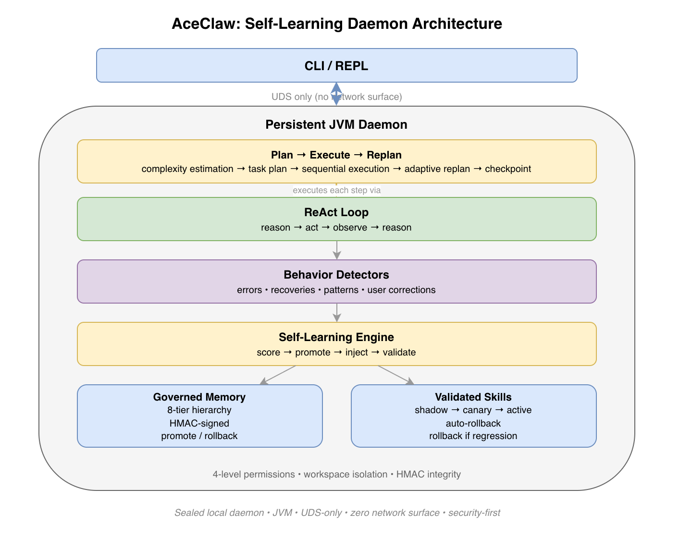

<h1 align="center">ace-copilot</h1>

<p align="center">A self-learning agent harness for long-running work</p>

<p align="center">
  <a href="https://github.com/xinhuagu/ace-copilot/actions/workflows/ci.yml"></a>
  
  
  
</p>

> **ace-copilot exists because long-running tasks demand learning.**
>
> When an agent runs for minutes or hours, context is not enough. It must absorb experience while it works, reuse what succeeds, and govern what it learns so it does not become noisy or unsafe.
> The goal is to make an agent behave more like an experienced engineering system over time.


An **agent harness** is the orchestration layer that turns LLMs into persistent, self-correcting workers — the loop that reasons, acts, observes, recovers, and remembers. Most harnesses treat each session as a blank slate. **ace-copilot doesn't.** It is built for long-running execution, where repeated failures, recoveries, tool sequences, and user corrections must become reusable knowledge instead of disappearing at the end of the session.

<p align="center">
  
</p>

**[Read the design philosophy: why Java, why no AI framework, and what drives the architecture.](docs/design-philosophy.md)**

ace-copilot is a persistent JVM daemon built for workflows that run for hours, not seconds. Pure Java 21, zero network attack surface, built from scratch around one idea:

**Memory helps an agent remember. Self-learning helps an agent improve.**

That is the spirit of ace-copilot, and it drives four key differentiators:

1. **Plan → Execute → Replan** — Most agent harnesses use a flat ReAct loop (think → act → observe, one step at a time). ace-copilot generates an **explicit task plan** before execution, runs it step by step with per-step iteration budgets, and **replans inline** when steps fail. Plans are streamed to the user in real time. This gives ace-copilot a structural advantage in long-running tasks — the agent has a visible roadmap instead of hoping the model stays on track turn by turn.
2. **Self-Learning** — Zero-cost heuristic detectors and session-end retrospectives turn agent behavior into durable learning signals. The agent evolves its own strategies without extra LLM calls in the hot path.
3. **Security** — UDS-only communication, sealed 4-level permissions, HMAC-signed memory
4. **Long-Term Memory** — 8-tier hierarchy, hybrid search, automated consolidation

**What makes this architecture different:**

- **Daemon-first, not CLI-first** — The JVM daemon persists across sessions. No cold start, no re-parsing config, no re-loading memory. The CLI is a thin JSON-RPC client over Unix Domain Socket.
- **Behavior-centric, not memory-centric** — Most agent memory systems store facts. ace-copilot observes *behavior* — error-recovery sequences, tool usage patterns, user corrections — and distills them into typed, confidence-scored insights. The agent doesn't just remember what happened; it learns *how it should act differently next time*.
- **Closed feedback loop** — Detectors emit typed insights → insights accumulate confidence across sessions → high-confidence insights get persisted → persisted memory is injected back into the next run. Repeated corrections auto-promote from auto-memory (Tier 6) to workspace rules (Tier 3).
- **Everything is sealed** — `Insight` (5 permits), `PermissionDecision` (3 permits), `MemoryTier` (8 permits), `StreamEvent`, `ContentBlock` — the compiler enforces exhaustive handling everywhere. Adding a new variant is a compile error until all switches are updated.

## Plan → Execute → Replan
<sub>Supported by research: <a href="https://arxiv.org/abs/2502.01390">Plan-Then-Execute (CHI 2025)</a></sub>

Most AI coding agents ([Claude Code](https://docs.anthropic.com/en/docs/claude-code/overview), [OpenClaw](https://github.com/openclaw), [Codex CLI](https://github.com/openai/codex)) rely on a flat **ReAct loop** — the model reasons and acts one step at a time. While effective for short tasks, this approach offers no explicit plan visibility and no structured failure recovery for long-running work.

ace-copilot takes a fundamentally different approach: it **layers an explicit planning pipeline on top of ReAct**. Each individual step is still executed by the same ReAct loop (reason → act → observe), which remains the best mechanism for single-step tool use. The difference is that ace-copilot wraps those steps in a higher-order plan that provides direction, budget control, and structured recovery — something a flat ReAct loop cannot do on its own.

```
Task → Complexity Estimator → Plan Generation (LLM) → Sequential Execution → Inline Replan
                                     │                        │                      │
                                     ▼                        ▼                      ▼
                              Structured JSON plan     Per-step iteration     On failure: executor
                              streamed to user         budgets                retries with fallback
                                                                              prompt or skips step
```

| Component | What it does |
|-----------|-------------|
| `ComplexityEstimator` | Scores task complexity; only triggers planning above a configurable threshold |
| `LLMTaskPlanner` | Generates a structured JSON plan with ordered, named steps |
| `SequentialPlanExecutor` | Executes steps one by one with per-step iteration budgets, fallback support, and cancellation between steps |

**Why this matters for long tasks:**

- **Visibility** — The user sees "Step 3/7: Refactor authentication module" in real time, not a stream of opaque tool calls.
- **Structured recovery** — When step N fails, the executor retries with a fallback prompt that includes the failure reason and remaining plan context.
- **Budget control** — Each step has its own iteration budget, preventing any single step from consuming the entire session.

**Planned (not yet implemented):** Crash-safe plan checkpointing to disk, cross-session plan resumption, and wall-clock per-step budgets.

## Security First

ace-copilot defends across five dimensions:

- **Zero network surface** — Daemon communicates only via Unix Domain Socket. No HTTP, no REST, no WebSocket.
- **Sealed permissions** — 4-level hierarchy (`READ`/`WRITE`/`EXECUTE`/`DANGEROUS`) modeled as a sealed interface with compiler-enforced exhaustiveness. Sub-agents receive filtered tool registries to prevent privilege escalation.
- **Signed memory** — Every persisted memory entry is HMAC-SHA256 signed with constant-time verification. Tampered entries are rejected on load.
- **Content boundaries** — System prompt budget (150K char cap), tool result truncation (30K cap), and 8-tier priority ordering ensure human-authored content always outranks agent-generated memory.
- **Data protection** — POSIX 600 on signing keys, SHA-256 hashed workspace paths, size governance with automatic consolidation.

See the [Security Details](docs/security.md) for the full breakdown.

## Self-Learning

ace-copilot learns from its own behavior — no LLM calls required. Every tool execution, error recovery, and user correction is analyzed by heuristic detectors that produce type-safe insights.

- **Automatic pattern detection** — `ErrorDetector` matches tool failures to subsequent retries. `PatternDetector` identifies repeated sequences, error-correction pairs, and user preferences. `SessionEndExtractor` captures corrections and strategies via regex-based passes at session close.
- **Cross-session accumulation** — Insights start at 0.4 confidence and gain +0.2 per recurrence. Only patterns reaching 0.7 confidence are persisted.
- **Strategy evolution** — Errors become `ErrorInsight`s, recurring sequences become `SuccessInsight`s, unresolved errors become anti-patterns, and underperforming skills are refined or rolled back. A closed feedback loop: detect → persist → recall → refine.
- **Type-safe insight hierarchy** — `Insight` is a sealed interface (`ErrorInsight | SuccessInsight | PatternInsight | RecoveryRecipe | FailureInsight`). The compiler enforces exhaustive handling.
- **Strategy refinement** — `StrategyRefiner` generates anti-patterns from persistent failures, strengthens user preferences from repeated corrections, and rolls back underperforming strategies. `SelfImprovementEngine` orchestrates the full pipeline as an async post-turn hook.
- **Baseline evaluation** — Continuous-learning KPIs and collection workflow are documented in `docs/continuous-learning-plan.md` with report templates and sample output.

See [Self-Learning Pipeline](docs/self-learning.md) for the full architecture.

## Long-Term Memory

8-tier persistent memory hierarchy with HMAC-SHA256 signing, hybrid TF-IDF search, and 3-pass consolidation:

```
T1: Soul (identity)  →  T2: Managed Policy (enterprise)  →  T3: Workspace (ACE_COPILOT.md)
T4: User Memory      →  T5: Local Memory (gitignored)     →  T6: Auto-Memory (JSONL+HMAC)
T7: Markdown Memory  →  T8: Daily Journal
```

- **HMAC-SHA256 integrity** — Every entry is signed. Mutable fields excluded from payload so reads don't invalidate signatures.
- **23 memory categories** — From `CODEBASE_INSIGHT` and `ERROR_RECOVERY` to `RECOVERY_RECIPE` and `FAILURE_SIGNAL`.
- **3-pass consolidation** — Dedup, similarity merge (>80% threshold), age prune (90 days, zero access). Triggered by the learning maintenance scheduler after session-close extraction and indexing.
- **Workspace isolation** — SHA-256 hashed paths under `~/.ace-copilot/workspaces/`. No cross-project leakage.

See [Memory System Design](docs/memory-system-design.md) for the full architecture.

## Context Engineering

ace-copilot actively manages what goes into the context window to keep long-running sessions effective:

```
User query → RequestFocus (symbol/file/plan extraction)
                ↓
System prompt → ContextAssemblyPlan (8-tier budget, priority ranking)
                ↓
Conversation  → Request-time pruning (transient, non-destructive)
                ↓
                → Context compaction (3-phase: prune → summarize → memory flush)
                ↓
Candidates    → CandidateStore (DRAFT → PROMOTED → IN_USE → ARCHIVED)
```

| Component | What it does |
|-----------|-------------|
| `SystemPromptBudget` | Enforces 150K total char cap and 20K per-tier cap; truncates lowest-priority tiers first (70% head / 20% tail / 10% marker) |
| `ContextAssemblyPlan` | Assembles the 8-tier memory hierarchy into a single system prompt, applying budget and priority ordering |
| `RequestFocus` | Extracts symbols, file paths, and plan signals from each user query to boost relevant context sections |
| `MessageCompactor.pruneForRequest()` | Produces a transient pruned copy of conversation for the LLM request without mutating session history |
| `ContextEstimator` | Tracks token usage from API responses; triggers 3-phase compaction at 85% of effective context window |
| `CandidateStore` | Manages memory candidate lifecycle (draft → promoted → in-use → archived) with exponential decay scoring |

**Observability** — The `/context` CLI command calls `context.inspect` over JSON-RPC and displays: system prompt share percentage, per-section char/token counts, inclusion reasons, active file paths, and injected candidate IDs.

See [Context Engineering](docs/context-engineering.md) for the full architecture.

## Quick Start

### One-Line Install

```bash
curl -fsSL https://raw.githubusercontent.com/xinhuagu/ace-copilot/main/install.sh | sh
```

Downloads the latest pre-built release, extracts to `~/.ace-copilot/`, and adds commands to your PATH. Only requires Java 21 runtime (no build tools).

### Configure & Run

```bash
export ANTHROPIC_API_KEY="sk-ant-api03-..."
ace-copilot                # Start ace-copilot (auto-starts daemon)
```

Or use OAuth (auto-discovered from Claude CLI credentials):
```bash
claude                 # Login via Claude CLI first
ace-copilot                # Token auto-refreshes from Keychain
```

### Commands

All commands installed by `install.sh`. Every command that accepts `[provider]` switches the LLM backend for that session.

| Command | What it does |
|---------|-------------|
| `ace-copilot` | Start ace-copilot TUI (auto-starts daemon if not running) |
| `ace-copilot-tui [provider]` | Open another TUI window — never restarts daemon, safe for multi-session |
| `ace-copilot-restart [provider]` | Stop daemon + restart with fresh build (warns if sessions active) |
| `ace-copilot-update` | Update to latest release (refuses if sessions active) |

**Supported providers:** `anthropic` (default), `copilot`, `openai`, `openai-codex`, `ollama`, `groq`, `together`, `mistral`

#### Daemon Management

The daemon is a persistent JVM process that runs in the background. It auto-starts when you run `ace-copilot`, but can be managed directly:

```bash
ace-copilot daemon start              # Start daemon in background
ace-copilot daemon start -p copilot   # Start background daemon with provider override
ace-copilot daemon start --foreground # Start daemon in foreground (for debugging)
ace-copilot daemon stop     # Gracefully stop daemon
ace-copilot daemon status   # Show health, version, model, active sessions
```

#### Switching Providers

Pass the provider name as an argument to any launch command:

```bash
# Release install (symlinked commands)
ace-copilot-restart copilot       # Restart daemon with GitHub Copilot
ace-copilot-tui ollama            # Open TUI against local Ollama (no daemon restart)
ace-copilot-restart anthropic     # Switch back to Anthropic Claude

# Or via environment variable (works with any command)
ACE_COPILOT_PROVIDER=groq ace-copilot
```

#### Provider Authentication

```bash
# Anthropic — API key or OAuth
export ANTHROPIC_API_KEY="sk-ant-api03-..."     # API key in env
# Or add to ~/.ace-copilot/config.json: {"apiKey": "sk-ant-api03-..."}
# Or login via Claude CLI for OAuth token auto-refresh

# GitHub Copilot — uses your existing subscription
ace-copilot-restart copilot                         # No extra key needed

# OpenAI / OpenAI Codex
export OPENAI_API_KEY="sk-..."
ace-copilot-restart openai
# Or OAuth for Codex:
ace-copilot models auth login --provider openai-codex
ace-copilot-restart openai-codex

# Ollama (local, offline, no key needed)
ace-copilot-restart ollama

# Groq / Together / Mistral
export OPENAI_API_KEY="gsk_..."                 # Provider-specific key
ace-copilot-restart groq
```

See [Provider Configuration](docs/provider-configuration.md) for full setup details.

### Build from Source (Developers)

```bash
git clone https://github.com/xinhuagu/ace-copilot.git && cd ace-copilot
./gradlew clean build && ./gradlew :ace-copilot-cli:installDist
./ace-copilot-cli/build/install/ace-copilot-cli/bin/ace-copilot-cli
```

Development scripts (from git checkout only — same provider argument support):

| Script | What it does |
|--------|-------------|
| `./dev.sh [provider]` | Rebuild + restart daemon + auto-benchmark on feature branches |
| `./restart.sh [provider]` | Rebuild + restart daemon (no benchmarks, fastest restart) |
| `./tui.sh [provider]` | Open TUI window (no restart, no rebuild if binary exists) |

```bash
./dev.sh                    # Default: anthropic, with benchmarks on feature branches
./dev.sh --no-bench copilot # Copilot, skip benchmarks
./restart.sh ollama         # Quick restart with Ollama
./tui.sh                    # Attach to running daemon
```

See [Multi-Session Model](docs/multi-session.md) for details on running multiple TUI windows.

## Platform Support

| Platform | Status | IPC | CI Gate |
|----------|--------|-----|---------|
| **Linux** | Fully supported | AF_UNIX | `pre-merge-check` — full test suite (required) |
| **macOS** | Fully supported | AF_UNIX | `platform-smoke` — build + cross-platform tests (required) |
| **Windows 10 1803+** | Experimental | AF_UNIX (JEP 380) | `platform-smoke` — build + cross-platform tests (required) |

All three platform checks are required for merging to main. Windows requires Java 21 runtime and Windows 10 version 1803 or later (for AF_UNIX socket support). See [Windows UDS Spike](docs/windows-uds-spike.md) for technical details.

## Tech Stack

Java 21 (preview features) · Gradle 8.14 · Picocli 4.7.6 · JLine3 3.27.1 · Jackson 2.18.2 · GraalVM Native Image · JUnit 5

## License

[Apache License 2.0](LICENSE)
