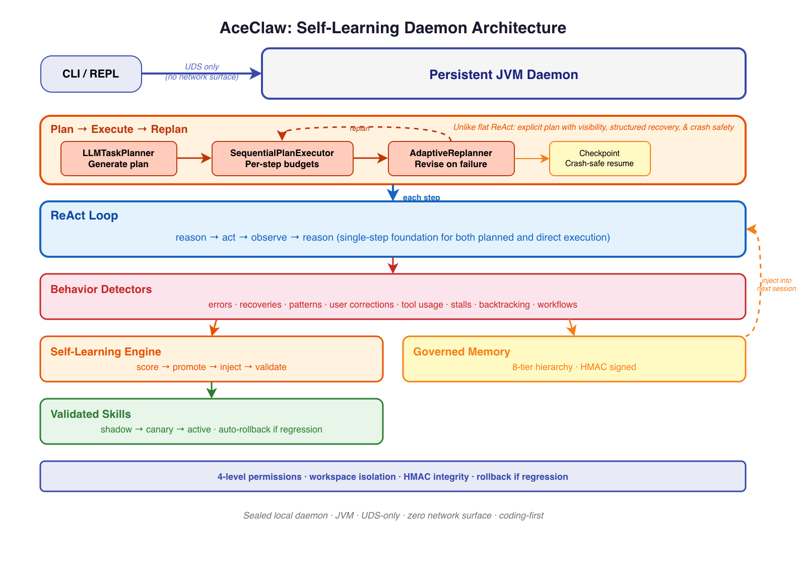

<h1 align="center">AceClaw</h1>

<p align="center">A self-learning agent harness for long-running work</p>

<p align="center">
  <a href="https://github.com/xinhuagu/AceClaw/actions/workflows/ci.yml"></a>
  
  
  
</p>

> **AceClaw exists because long-running tasks demand learning.**
>
> When an agent runs for minutes or hours, context is not enough. It must absorb experience while it works, reuse what succeeds, and govern what it learns so it does not become noisy or unsafe.

An **agent harness** is the orchestration layer that turns LLMs into persistent, self-correcting workers — the loop that reasons, acts, observes, recovers, and remembers. Most harnesses treat each session as a blank slate. **AceClaw doesn't.** It is built for long-running execution, where repeated failures, recoveries, tool sequences, and user corrections must become reusable knowledge instead of disappearing at the end of the session.

<p align="center">
  
</p>

AceClaw is a persistent JVM daemon built for workflows that run for hours, not seconds. Pure Java 21, zero network attack surface. Inspired by [Claude Code](https://docs.anthropic.com/en/docs/claude-code/overview) and [OpenClaw](https://github.com/openclaw), built from scratch around one idea:

**Memory helps an agent remember. Self-learning helps an agent improve.**

That is the spirit of AceClaw, and it drives three key differentiators:

1. **Self-Learning** — Zero-cost heuristic detectors, session retrospectives, historical indexing, cross-session pattern mining, and trend detection turn agent behavior into durable learning signals. The agent evolves its own strategies without extra LLM calls in the hot path.
2. **Security** — UDS-only communication, sealed 4-level permissions, HMAC-signed memory
3. **Long-Term Memory** — 8-tier hierarchy, hybrid search, automated consolidation

**What makes this architecture different:**

- **Daemon-first, not CLI-first** — The JVM daemon persists across sessions. No cold start, no re-parsing config, no re-loading memory. The CLI is a thin JSON-RPC client over Unix Domain Socket.
- **Behavior-centric, not memory-centric** — Most agent memory systems store facts. AceClaw observes *behavior* — error-recovery sequences, tool usage patterns, user corrections — and distills them into typed, confidence-scored insights. The agent doesn't just remember what happened; it learns *how it should act differently next time*.
- **Closed feedback loop** — Detectors emit typed insights → insights accumulate confidence across sessions → high-confidence insights get persisted → persisted memory is injected back into the next run. Repeated corrections auto-promote from auto-memory (Tier 6) to workspace rules (Tier 3).
- **Everything is sealed** — `Insight` (5 permits), `PermissionDecision` (3 permits), `MemoryTier` (8 permits), `StreamEvent`, `ContentBlock` — the compiler enforces exhaustive handling everywhere. Adding a new variant is a compile error until all switches are updated.

## Security First

AceClaw defends across five dimensions:

- **Zero network surface** — Daemon communicates only via Unix Domain Socket. No HTTP, no REST, no WebSocket.
- **Sealed permissions** — 4-level hierarchy (`READ`/`WRITE`/`EXECUTE`/`DANGEROUS`) modeled as a sealed interface with compiler-enforced exhaustiveness. Sub-agents receive filtered tool registries to prevent privilege escalation.
- **Signed memory** — Every persisted memory entry is HMAC-SHA256 signed with constant-time verification. Tampered entries are rejected on load.
- **Content boundaries** — System prompt budget (150K char cap), tool result truncation (30K cap), and 8-tier priority ordering ensure human-authored content always outranks agent-generated memory.
- **Data protection** — POSIX 600 on signing keys, SHA-256 hashed workspace paths, size governance with automatic consolidation.

See [Security Details](#security-details) for the full breakdown and [Security Roadmap](#security-roadmap) for planned hardening.

## Self-Learning

AceClaw learns from its own behavior — no LLM calls required. Every tool execution, error recovery, and user correction is analyzed by heuristic detectors that produce type-safe insights.

- **Automatic pattern detection** — `ErrorDetector` matches tool failures to subsequent retries. `SessionEndExtractor` captures user corrections and preferences via regex-based passes. `SessionAnalyzer`, `HistoricalLogIndex`, `CrossSessionPatternMiner`, and `TrendDetector` extend that learning across sessions.
- **Cross-session accumulation** — Insights start at 0.4 confidence and gain +0.2 per recurrence. Only patterns reaching 0.7 confidence are persisted.
- **Strategy evolution** — Errors become `ErrorInsight`s, recurring sequences become `SuccessInsight`s, unresolved errors become anti-patterns, and underperforming skills are refined or rolled back. A closed feedback loop: detect → persist → recall → refine.
- **Type-safe insight hierarchy** — `Insight` is a sealed interface (`ErrorInsight | SuccessInsight | PatternInsight | RecoveryRecipe | FailureInsight`). The compiler enforces exhaustive handling.
- **Deferred maintenance scheduler** — Session end performs extraction and indexing immediately; heavier consolidation, pattern mining, and trend detection run through background maintenance triggers (time, session count, size, idle).
- **Baseline evaluation** — Continuous-learning KPIs and collection workflow are documented in `docs/continuous-learning-plan.md` with report templates and sample output.

See [Self-Learning Pipeline](docs/self-learning.md) for the full architecture.

## Long-Term Memory

8-tier persistent memory hierarchy with HMAC-SHA256 signing, hybrid TF-IDF search, and 3-pass consolidation:

```
T1: Soul (identity)  →  T2: Managed Policy (enterprise)  →  T3: Workspace (ACECLAW.md)
T4: User Memory      →  T5: Local Memory (gitignored)     →  T6: Auto-Memory (JSONL+HMAC)
T7: Markdown Memory  →  T8: Daily Journal
```

- **HMAC-SHA256 integrity** — Every entry is signed. Mutable fields excluded from payload so reads don't invalidate signatures.
- **23 memory categories** — From `CODEBASE_INSIGHT` and `ERROR_RECOVERY` to `RECOVERY_RECIPE` and `FAILURE_SIGNAL`.
- **3-pass consolidation** — Dedup, similarity merge (>80% threshold), age prune (90 days, zero access). Triggered by the learning maintenance scheduler after session-close extraction and indexing.
- **Workspace isolation** — SHA-256 hashed paths under `~/.aceclaw/workspaces/`. No cross-project leakage.

See [Memory System Design](docs/memory-system-design.md) for the full architecture.

## Quick Start

```bash
# Build
./gradlew clean build && ./gradlew :aceclaw-cli:installDist

# Configure
export ANTHROPIC_API_KEY="sk-ant-api03-..."

# Run (auto-starts daemon)
./aceclaw-cli/build/install/aceclaw-cli/bin/aceclaw-cli
```

Multi-provider support — see [Provider Configuration](docs/provider-configuration.md) for full setup:
```bash
# GitHub Copilot (use your subscription — no separate API key needed)
./dev.sh copilot

# OpenAI Codex OAuth (reuse ~/.codex/auth.json)
aceclaw models auth login --provider openai-codex
./dev.sh openai-codex
# Note: in openai-codex mode, AceClaw follows Codex backend rules
# (stream=true, store=false, no temperature/max_output_tokens).

# Ollama (local, offline)
./dev.sh ollama

# Or any OpenAI-compatible provider
export ACECLAW_PROVIDER="openai"   # or groq, together, mistral
export OPENAI_API_KEY="sk-..."
```

## Architecture

```
CLI (Picocli + JLine3)
  │ JSON-RPC 2.0 over UDS only ← zero network surface
Daemon (persistent JVM, separate process group)
  ├─ Request Router       → method dispatch
  ├─ Session Manager      → per-project sessions (isolated state)
  ├─ Streaming Agent Loop → ReAct loop (max 25 iterations)
  ├─ Task Planner         → complexity estimation, LLM plan generation, sequential execution
  ├─ Permission Manager   → sealed 4-level gate (READ/WRITE/EXECUTE/DANGEROUS)
  ├─ Tool Registry        → 12 native tools + MCP (filtered per sub-agent)
  ├─ Memory System        → 8-tier hierarchy, HMAC-signed, hybrid search
  ├─ Self-Learning        → ErrorDetector, ToolMetrics, SessionAnalyzer, historical index, pattern mining, trend detection, skill feedback
  ├─ Context Compactor    → 3-phase (memory flush → prune → summarize)
  ├─ Scheduler            → persistent cron jobs, heartbeat runner, learning maintenance
  ├─ Hook System          → BOOT.md startup, command hooks
  └─ LLM Client Factory   → 8 providers, extended thinking, prompt caching
```

### Modules

| Module | Purpose |
|--------|---------|
| `aceclaw-core` | LLM abstractions, agent loop, tool interface, context compaction, task planner |
| `aceclaw-llm` | Anthropic + OpenAI-compatible LLM clients |
| `aceclaw-tools` | 12 built-in tools (file ops, bash, glob, grep, web search, web fetch) |
| `aceclaw-security` | Sealed permission model (AutoAllow / PromptOnce / AlwaysAsk / Deny) |
| `aceclaw-memory` | [8-tier memory hierarchy](docs/memory-system-design.md), hybrid search, consolidation, HMAC integrity |
| `aceclaw-mcp` | MCP client integration for external tools |
| `aceclaw-daemon` | Daemon process, UDS listener, streaming handler, [self-learning detectors](docs/self-learning.md) |
| `aceclaw-cli` | CLI entry point, REPL, daemon lifecycle |

## Security Details

### Architecture Isolation

- **Zero network surface** — Daemon listens ONLY on Unix Domain Socket (`~/.aceclaw/aceclaw.sock`). No HTTP, no REST, no WebSocket.
- **Single entry point** — CLI → UDS → Daemon. There is no other way in.
- **Signal isolation** — Daemon runs in a separate process group, so CLI signals (Ctrl+C) don't kill the daemon or corrupt session state.
- **Session-scoped state** — Each session has isolated conversation history; no cross-session data leakage.

### Sealed Permission Model

```
READ        → auto-approved (file reads, glob, grep)
WRITE       → user approval required (file writes, edits)
EXECUTE     → user approval required (bash commands)
DANGEROUS   → always prompt, never remembered
```

- `PermissionDecision` is a **sealed interface** — `Approved | Denied | NeedsUserApproval`. The compiler enforces exhaustive handling.
- Sub-agents receive **filtered tool registries** — restricted tool sets prevent privilege escalation through nesting.

### Memory Integrity

- **HMAC-SHA256** per entry with constant-time verification — tampered entries are rejected.
- **POSIX 600** on the signing key file — only the owning user can read it.
- **SHA-256 hashed workspace paths** — workspace isolation without leaking directory names.
- **3-pass memory consolidation** — prevents memory pollution and unbounded growth; now runs via deferred learning maintenance rather than inline session teardown.

### Content Boundaries

- **System prompt budget** — 150K total character cap + 20K per-tier cap. Tiers exceeding budget are truncated (70% head / 20% tail / 10% marker).
- **8-tier priority ordering** — Human-authored content always outranks agent-generated memory.
- **Tool result truncation** — Tool outputs capped at 30K characters to limit injection surface.
- **Managed Policy tier** — Reserved slot for enterprise-managed rules loaded from `~/.aceclaw/managed-policy.md`.

## Security Roadmap

| Phase | Feature | Purpose |
|-------|---------|---------|
| **S1** | Trust-level content sandboxing | Wrap memory tiers with trust metadata, differentiated preambles per trust level |
| **S1** | SOUL.md override protection | Prevent workspace-level SOUL.md from overriding global identity |
| **S1** | Memory write rate limiting | Cap agent-generated memory entries per session |
| **S2** | Memory write visibility | Surface auto-extracted memories to user for review before persistence |
| **S2** | Encryption at rest (AES-256) | Encrypt memory content on disk |
| **S3** | Provenance tracking | Record origin chain for each memory entry |
| **S3** | Memory quarantine | Isolate untrusted entries for review |
| **S3** | Audit trail | Structured log of agent actions and permission decisions |

## Roadmap

- [x] Daemon-first architecture, streaming ReAct loop, 12 tools
- [x] Extended thinking, retry, prompt caching, context compaction
- [x] Multi-provider (8 providers), HMAC-signed memory, MCP integration
- [x] 8-tier memory hierarchy, hybrid search, daily journal, workspace isolation
- [x] Sub-agents: depth-1 delegation, filtered tool registries, task lifecycle
- [x] Self-learning: insight hierarchy, error/pattern detection, self-improvement engine
- [x] Historical learning: session retrospectives, historical index, cross-session pattern mining, trend detection
- [x] Adaptive skills: metrics, skill memory feedback, refinement, rollback
- [x] Candidate pipeline: injected-candidate outcome writeback, clock-injected gates, stale cleanup, score decay
- [x] Hook system: BOOT.md startup execution, command hooks, persistent cron, heartbeat runner
- [x] Task planner: complexity estimation, LLM plan generation, sequential execution
- [ ] Security hardening: content sandboxing, trust levels, encryption at rest
- [ ] Agent teams: virtual thread teammates, shared tasks, inter-agent messaging

## Tech Stack

Java 21 (preview features) · Gradle 8.14 · Picocli 4.7.6 · JLine3 3.27.1 · Jackson 2.18.2 · GraalVM Native Image · JUnit 5

## License

[Apache License 2.0](LICENSE)
