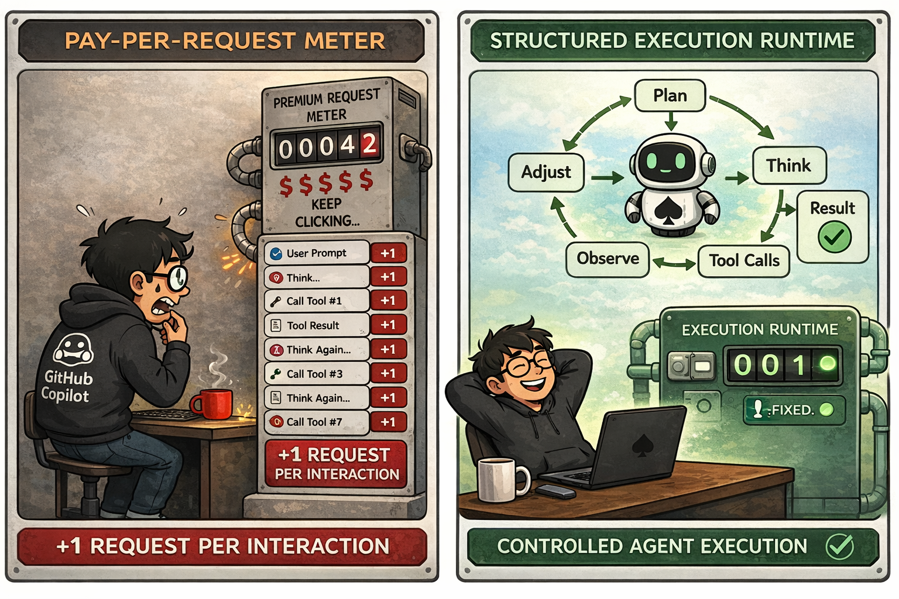

<h1 align="center">ace-copilot</h1>

<p align="center">A GitHub Copilot–focused agent harness. One premium request per user turn — on purpose.</p>

<p align="center">
  <a href="https://github.com/xinhuagu/ace-copilot/actions/workflows/ci.yml"></a>
  
  
  
</p>

> GitHub Copilot bills by **premium request** on a hard monthly quota — a model unfriendly to agent harnesses. Hidden session-endpoint multipliers, trimmed context windows, and — once the quota runs out — **expensive overage priced materially above direct API access on the short agent turns people actually run**. ace-copilot uses Copilot's own session SDK in a CLI/daemon so a multi-tool, multi-iteration agent turn **collapses to a single `sendAndWait`** — one premium request on Haiku (the default), three on Sonnet/GPT — and surfaces the costs Copilot hides.

<p align="center">
  
</p>

## Quick Start

### Install

```bash
curl -fsSL https://raw.githubusercontent.com/xinhuagu/ace-copilot/main/install.sh | sh
```

Requires Java 21 runtime. Node.js 20+ is needed for the Copilot session runtime (without it the daemon falls back to the chat path).

### Run against Copilot

```bash
ace-copilot-restart copilot    # Start daemon in Copilot session mode
ace-copilot                    # Attach TUI
```

First-time login: `gh auth login` (preferred) or the device-code flow ace-copilot prints on first start. A GitHub Copilot subscription (Individual / Business / Enterprise) is required.

### Choose a model

Default is `claude-haiku-4.5` — the only Copilot model with a 1× session-mode multiplier; every other model is 3×. Switch mid-session with `/model <name>` or at launch with `ACE_COPILOT_MODEL=...`. See [docs/provider-configuration.md](docs/provider-configuration.md) for the full model list and per-model notes.

## Commands

| Command | What it does |
|---------|-------------|
| `ace-copilot` | Start TUI (auto-starts daemon if not running) |
| `ace-copilot-tui [profile]` | Open another TUI window — non-destructive, no daemon restart |
| `ace-copilot-restart [profile]` | Stop daemon + restart with fresh build |
| `ace-copilot-update` | Update to latest release |
| `ace-copilot daemon start\|stop\|status` | Daemon lifecycle |

## Savings at a glance

| Scenario | Stock `/chat/completions` | ace-copilot session runtime |
| --- | --- | --- |
| Simple 1-turn answer | 1 premium | **1 premium** |
| ReAct task with 5 tool iterations | ~5 premium | **1 premium** |
| Task + 3 clarifying follow-ups | ~8 premium | **1 premium** |

Every ace-copilot design decision is measured against one rule: a plain user prompt must cost **exactly one premium request**. Any subsystem that would add extra Copilot work has to earn its keep — most don't (see Phase 4 locked decisions in [docs/copilot-session-runtime.md](docs/copilot-session-runtime.md)).

## Why this project exists — Copilot billing facts

ace-copilot only makes sense if you know exactly what you are working against. These are the concrete, operator-verified facts that motivate everything below.

### 1. Copilot bills by "premium request", and the quota is hard-capped per month

Unlike pay-as-you-go APIs (Anthropic, OpenAI direct, Ollama-local) where you pay per token at a rate you can reason about up front, GitHub Copilot gives you a fixed number of premium requests per month and every LLM call that hits their endpoint consumes one (or more — see Fact 2). When the monthly pool runs out you have three options: wait for the next billing cycle, upgrade the plan, or [buy overage at **$0.04 per premium request**](https://github.blog/changelog/2025-08-22-premium-request-overage-policy-is-generally-available-for-copilot-business-and-enterprise/) — the overage policy went GA for Business / Enterprise on 2025-08-22.

What overage actually costs you depends on the session-path 3× multiplier and the per-model base multiplier:

| Per turn | Base | After 3× session | Overage $/turn |
| --- | --- | --- | --- |
| Haiku 4.5 | 0.33 | 1 premium | **$0.04** |
| Sonnet 4.5 / 4.6 | 1 | 3 premium | **$0.12** |
| GPT-5.4 | 1 | 3 premium | **$0.12** |
| Frontier / reasoning (5×/20× base) | 5–20 | 15–60 premium | **$0.60–$2.40** |

So the ceiling isn't there, but it is replaced with pricing that is **far above** what you'd pay going direct to the provider for the same model token-for-token.

On [**Copilot Enterprise**](https://docs.github.com/en/copilot/get-started/plans) (1,000 premium requests/month per seat — the canonical reference plan for this project), a single request consumes **0.1%** of the monthly budget before overage kicks in. A single complex task on the stock chat path can eat 0.5–1% of your month before overage.

### 2. The session endpoint applies a flat 3× multiplier on top of the published model multipliers

GitHub publishes a "model multiplier" table — 0.33× for Haiku-class, 1× for mid-range Claude and GPT, higher for frontier models. **The session SDK path (`sendAndWait`) multiplies that table by 3.** Verified by repeated observation of the GitHub Copilot usage dashboard (Settings → Billing & Plans → Copilot premium requests) across many turns:

| Model | Published multiplier (chat path) | Observed per-turn on session path | Ratio |
| --- | --- | --- | --- |
| Claude Haiku 4.5 | 0.33× | **1×** | 3× |
| Claude Sonnet 4.5 | 1× | **3×** | 3× |
| Claude Sonnet 4.6 | 1× | **3×** | 3× |
| GPT-5.4 | 1× | **3×** | 3× |

Operational consequence: **Haiku is the cheapest option on session mode too.** Three Haiku session turns fit in the premium budget of one Sonnet session turn. On Enterprise (1,000 requests/month), a Sonnet session turn consumes **0.3%** of your monthly budget; a Haiku session turn consumes **0.1%**.

This project defaults to Haiku on session mode for that reason. When you explicitly need Sonnet/Opus/GPT capability, use them — but budget for the 3× cost relative to Haiku and be explicit about the tradeoff.

(The chat-completions path still honors the published multipliers without the 3× surcharge. If GitHub ever publishes clarifying documentation for the agent endpoint, update this section.)

### 3. Copilot caps Claude context windows below the model's native capacity

Anthropic publishes Claude Sonnet 4.6 at **200K tokens** native, **500K on Enterprise plans**, and **1M via the `context-1m-2025-08-07` beta header** (see [Anthropic Sonnet 4.5 announcement](https://www.anthropic.com/news/claude-sonnet-4-5) and [Claude API context-windows docs](https://platform.claude.com/docs/en/build-with-claude/context-windows)).

Through GitHub Copilot, multiple layers trim that further:

- **The 1M beta header is never forwarded.** Copilot Chat's Anthropic provider does not pass `context-1m-2025-08-07`, so Sonnet 4.6 / Opus 4.6 requests stay capped at 200K even when the account would otherwise qualify. Tracked in [microsoft/vscode#298901](https://github.com/microsoft/vscode/issues/298901) — not merged as of this writing.
- **`max_prompt_tokens` is under-reported vs. the 200K cap.** Copilot's own CAPI response advertises a prompt-token limit below 200K for Sonnet 4.6 / Opus 4.6, so Copilot-side compaction fires **~40K tokens earlier** than the nominal window. Filed as [microsoft/vscode#298900](https://github.com/microsoft/vscode/issues/298900).
- **Effective usable window ≈ 128K in practice.** Third-party harness authors measuring the real limit observe the usable context to be closer to 128K than 200K — [anomalyco/opencode#16129](https://github.com/anomalyco/opencode/issues/16129).
- **~40% of the window silently reserved for output.** Copilot users see roughly 40% of the advertised window held back for output tokens even when the prompt is small — [github/community#188691](https://github.com/orgs/community/discussions/188691), [github/community#186340](https://github.com/orgs/community/discussions/186340).

Stack those together: the Copilot-branded "Sonnet 4.6" behaves like a model with a meaningfully smaller context than Anthropic's model-card-advertised 200K (nowhere close to the 1M beta or the Enterprise 500K path). Operators should assume closer to **~128K effective prompt budget** on session mode and plan compaction / tool use accordingly.

### What this means for the architecture

Every design decision in ace-copilot — one `sendAndWait` per user turn, planner kept in-session, compaction dropped, post-turn learning skipped, honest per-turn and session-total billing UX — is a direct answer to these three facts. The goal is to make the most of a finite, opaque, capped budget inside a proxy that trims context without telling us.

Full Phase 4 decision table, diagnostic fields, and live verification walkthrough: [docs/copilot-session-runtime.md](docs/copilot-session-runtime.md).

## Docs

- **[Copilot session runtime](docs/copilot-session-runtime.md)** — Phase 4 locked decisions, telemetry / diagnostic fields, verification walkthrough.
- **[Phase 4 audit](docs/copilot-phase4-audit.md)** — LLM call-site inventory and per-site decisions (dev-facing).
- **[Provider configuration](docs/provider-configuration.md)** — available models, auth modes, env vars.
- **[Multi-session model](docs/multi-session.md)** — multiple TUI windows on one daemon.
- **[Design philosophy](docs/design-philosophy.md)** — why Java, why no AI framework.

## Build from Source

```bash
git clone https://github.com/xinhuagu/ace-copilot.git && cd ace-copilot
./gradlew clean build && ./gradlew :ace-copilot-cli:installDist
```

Dev scripts: `./dev.sh`, `./restart.sh`, `./tui.sh` (all accept `[profile]` arg).

## Platform Support

| Platform | Status |
|----------|--------|
| **Linux** | Fully supported |
| **macOS** | Fully supported |
| **Windows 10 1803+** | Experimental |

## Tech Stack

Java 21 · Gradle 8.14 · Node 20+ · Picocli · JLine3 · Jackson · JUnit 5

## License

[Apache License 2.0](LICENSE)
